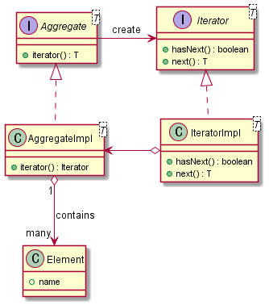

Iterator
========

데이터의 순차 처리 패턴

컬렉션 데이터를 순차적으로 가져와서 처리

## UML

## 관련 패턴
[Visitor](../../../../../docs/behavioral/Visitor.md)
[Composite](../../../../../docs/structural/Composite.md)
[Factory Method](../../../../../docs/creational/FactoryMethod.md)
